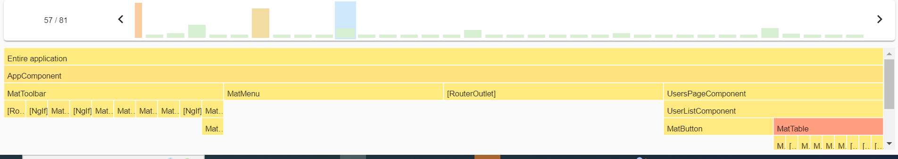

# FitBooking

### [Click here to access the github repository](https://github.com/242darkman/sport-resa.git)

### Project web developer

1. VOUVOU Brandon
2. KEITA Lansana
3. ATINHOUNON Nalvac

### Default account usernames

1. 242darkman
2. lanskei
3. nalvac
4. user

Password for all accounts is `passer123`

## Install project dependencies

Run `yarn` or `yarn install` for installing all projects dependencies

## Development server

Run `yarn start` for a dev server. Navigate to `http://localhost:4200/`. The application will automatically reload if you change any of the source files.

## Fonctionnalités

### Authentification

- **Création de compte** : Les nouveaux utilisateurs peuvent créer un compte en fournissant les informations nécessaires telles que le nom d'utilisateur, l'adresse e-mail et le mot de passe.

- **Connexion** : Les utilisateurs peuvent se connecter à leur compte en utilisant leur username et leur mot de passe.

- **Déconnexion** : Les utilisateurs peuvent se déconnecter de leur compte à tout moment pour garantir la sécurité de leurs informations.

### Consultation des séances de sport

- Les utilisateurs doivent pouvoir consulter les séances de sport disponibles.
- Les séances de sport doivent être affichées par établissement, thème , date et
  heure.
- Les utilisateurs doivent pouvoir filtrer les séances de sport en fonction de critères tels que la localisation, le thème et la date

### Réservation de séances de sport

- Les utilisateurs authentifiés doivent pouvoir réserver une séance de sport disponible.
- En cas de conflit de réservation pour un même créneau horaire, l'utilisateur doit pouvoir choisir parmi les établissements disponibles.
- Les utilisateurs doivent pouvoir visualiser

### Gestion des établissements

- Les administrateurs de l'application doivent pouvoir gérer les établissements, y compris l'ajout, la modification et la suppression des établissements
- Les informations sur les établissements, telles que les horaires d'ouverture, les adresses, les coordonnées, etc.doivent être configurables.

### Notifications

- Les utilisateurs doivent recevoir des notifications de confirmation de réservation.
- Les utilisateurs doivent être avertis des annulations ou des modifications de réservation.

;
Les barres vertes indique des opérations qui sont optimisées et qui s'exécutent bien.
Le jaune indique des avertissements ou des opérations qui prennent plus de temps que la normale à s'exécuter

## Code scaffolding

Run `ng generate component component-name` to generate a new component. You can also use `ng generate directive|pipe|service|class|guard|interface|enum|module`.
